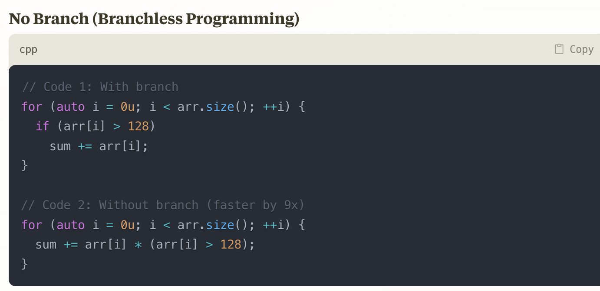
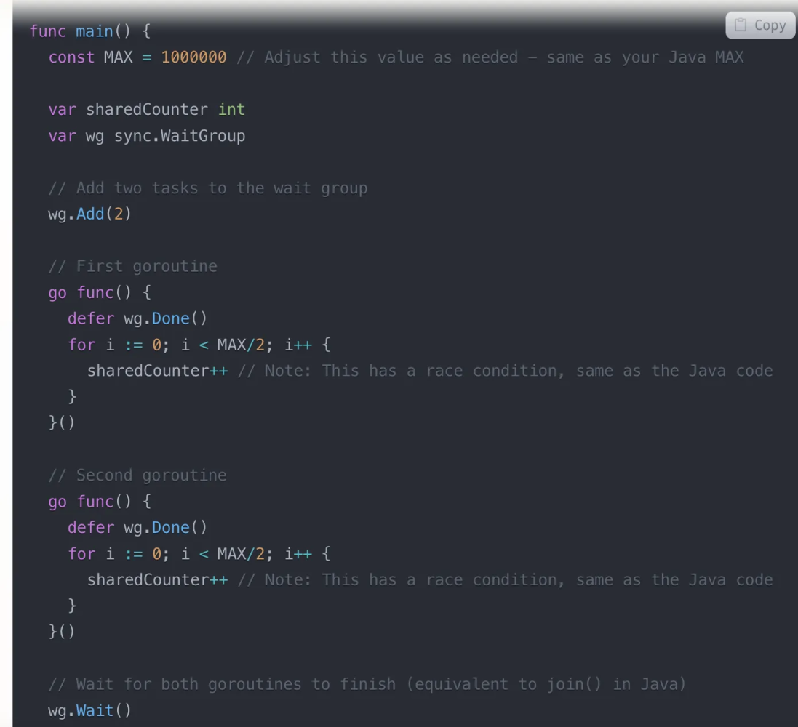
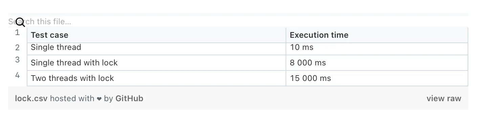
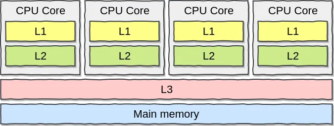
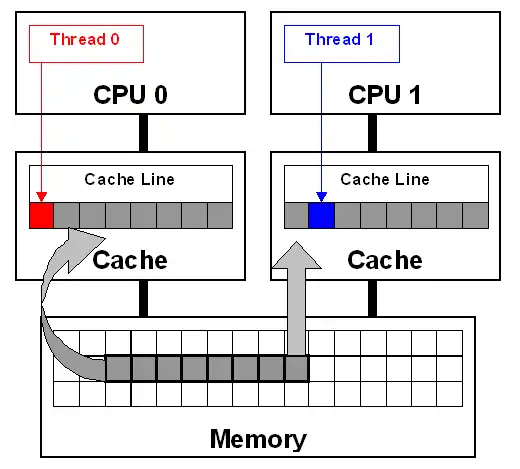
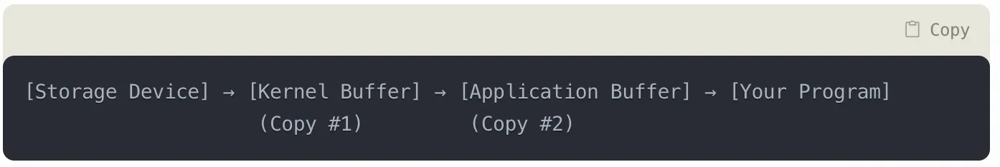
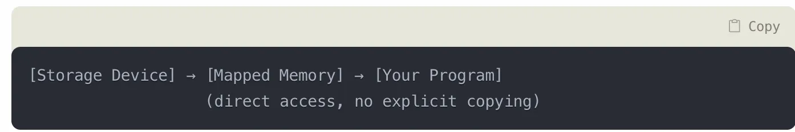
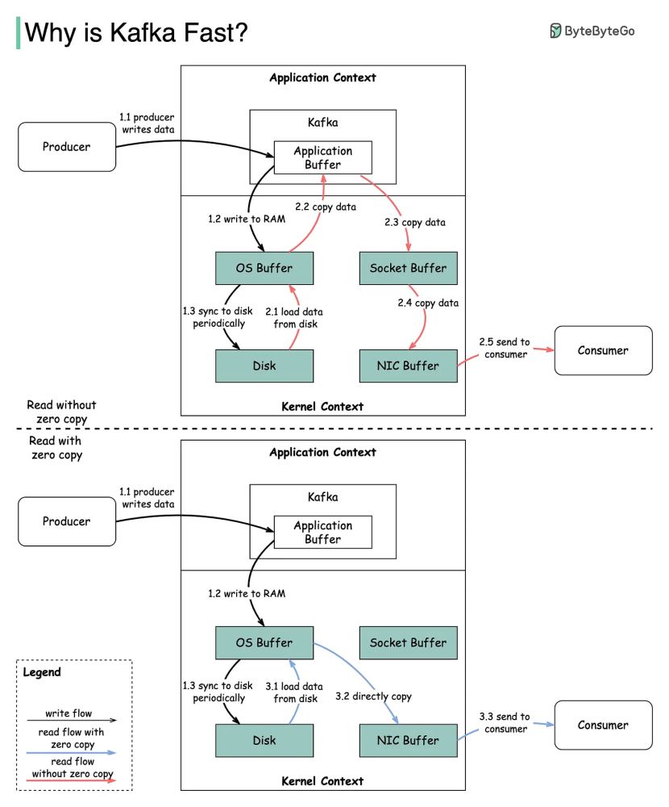
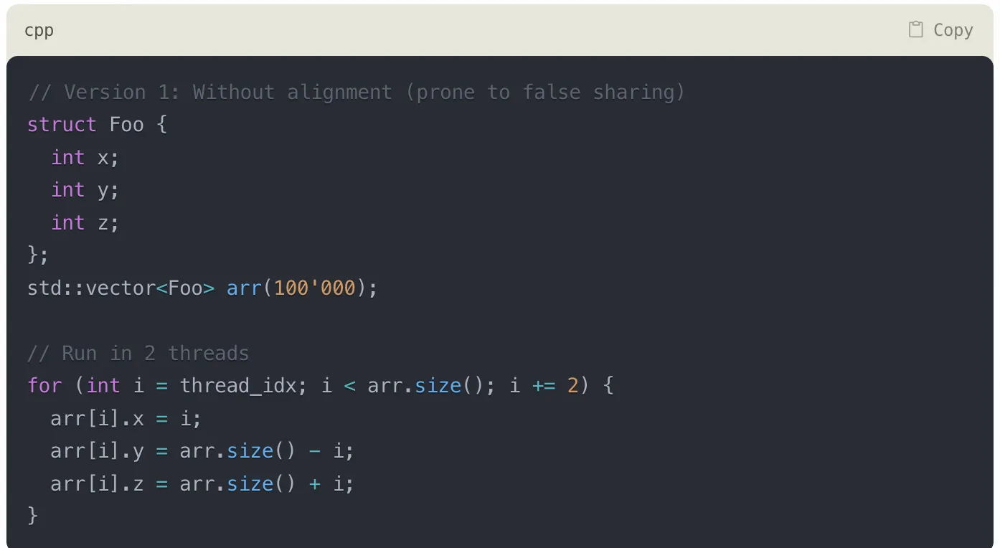
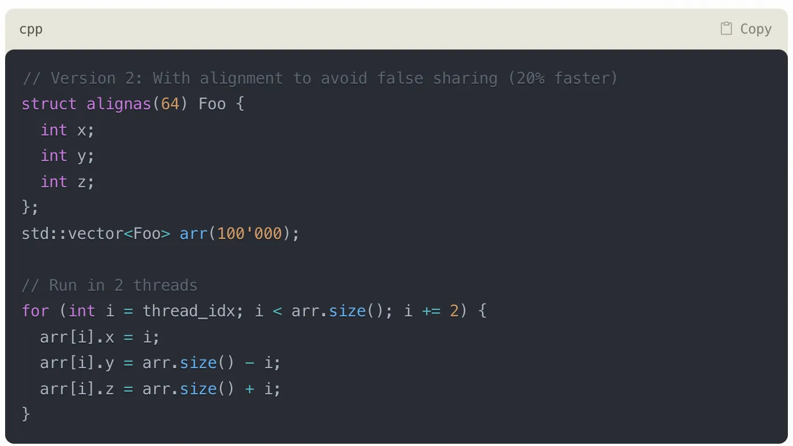

+++
date = '2025-03-23'
draft = false
title = 'Tìm hiểu về độ trễ trong bộ xử lý trung tâm và ổ cứng: Tối ưu hóa hiệu suất hệ thống'
tags = ['cpu', 'performance', 'latency', 'system-design', 'kafka']
+++

Truy cập qua ổ đĩa thì bao giờ cũng chậm hơn là xử lý trên RAM rồi, qua CPU Cache còn nhanh hơn nữa, vậy tận dụng và ứng dụng vào thực tế như nào? Mời anh em tham khảo bài này.

## Độ trễ (Latency)

Đầu tiên, nói về độ trễ, chúng ta có một số ý chính như sau:

* Truy xuất từ ổ đĩa sẽ chậm hơn 80 lần so với RAM, dù thay thế bằng ổ SSD thì vẫn chậm hơn 4 lần so với RAM

Sắp xếp theo thứ tự nhanh nhất trước, chúng ta có:

* **L1 Cache CPU**: 0.5 ns (1 ns = 10^-9 seconds)
* **L2 Cache**: 7 ns
* **Main memory**: 100 ns
* **SSD**: 1,000,000 ns for 1MB
* **Disk**: 20,000,000 ns for 1MB

Phạm vi bài viết này sẽ tập trung vào độ trễ trong CPU và ổ đĩa (Disk). Cách tiếp cận ở đây, chúng ta cần bắt đầu từ các khái niệm về CPU trước.

## Dự đoán nhánh trong CPU (Branch Prediction)

Các dòng CPU bây giờ có khả năng xử lý nhiều tập lệnh (instructions) đồng thời, tuy nhiên sẽ gặp vấn đề với các lệnh rẽ nhánh (if-else, switch-case,…). Khi CPU gặp một lệnh rẽ nhánh, nó không thể biết chắc chắn lệnh nào sẽ được thực hiện tiếp theo cho đến khi điều kiện rẽ nhánh được tính toán xong. Đây là một vấn đề lớn sẽ tốn nhiều chu kỳ đồng hồ (CPU Cycles), đường ống có thể bị "đói" lệnh, hiệu suất tổng thể CPU sẽ giảm.

Giải pháp các kỹ sư đưa ra khi thiết kế cho CPU, sẽ có một bộ phận gọi là dự đoán (**branch predictor**), khi gặp câu lệnh điều kiện, nó không chờ mà dự đoán luôn, nếu sai thì chấp nhận bỏ hết đi mà làm người :)) Nên chúng ta mới thấy dòng Branch Mispredict Penalty là 5ns ở đầu bài.

Ví dụ về việc hạn chế rẽ nhánh khi lập trình sẽ giúp CPU của chúng ta nhàn hơn, hiệu suất nhanh hơn (9 lần).



## Ảo tưởng về bộ nhớ chung (Shared memory)

Các process/thread của CPU sẽ sử dụng chung một vùng không gian nhớ chung (share memory). Việc tương tác giữa hai process sẽ hoàn toàn do việc đọc/ghi trên vùng nhớ chung này. OS không hề can thiệp vào quá trình này, thế nên shared memory là phương pháp nhanh nhất (nhanh về mặt tốc độ) để các process nói chuyện với nhau. Tuy nhiên, nhược điểm của phương pháp này là các process phải tự quản lý việc đọc ghi dữ liệu, và quản lý việc tranh chấp tài nguyên (race condition).

Bài toán đặt ra là giờ dùng 2 threads cùng tăng 1 biến chung counter lên, thì có nhanh hơn là dùng 1 thread tăng không? Giả sử không quan tâm đến vấn đề race condition. Xem ví dụ dưới đây:



Thực tế thì việc chạy 2 threads không nhanh hơn, thậm chí 1 số thực nghiệm còn chậm hơn 3 lần.



Vấn đề ở đây là gì? Trước hết phải nhớ đến CPU Caches. CPU giờ có nhiều lõi (core), mỗi lõi có bộ nhớ riêng L1, L2 (shared memory) và bộ nhớ chung L3 cho tất cả các lõi. CPU khi hoạt động sẽ cache data lên các bộ nhớ này, chương trình khi chạy sẽ kiểm tra L1, L2 trước, sau mới đến L3 và RAM.



Chú ý rằng bộ nhớ của L1 và L2 khá nhỏ: 32KB với L1 và 256KB với L2.

Để hiểu rõ nguyên nhân tại sao dùng 2 threads lại chậm hơn, ta cần để ý thêm **Cache line** — hiểu đơn giản đây là đơn vị nhỏ nhất của việc chuyển dữ liệu qua lại giữa Main Memory và CPU Cache, 1 đơn vị thông thường là 64 bytes. Khi CPU cần đọc 1 byte từ RAM, nó sẽ phải đọc toàn bộ 1 cache line (64 bytes).

Cái này dựa trên nguyên lý không gian cục bộ (**spatial locality**) là nếu mày đọc 1 byte data thì khả năng mày cũng cần những thằng liền kề.

Vấn đề chính ở đây khi 2 threads cùng sửa giá trị 1 biến counter là **False Sharing**. Khi nhiều lõi CPU mặc dù có làm việc với nhiều biến khác nhau nhưng chúng lại cùng nằm trên 1 Cache Line. Cụ thể giả sử có 2 biến X và Y:

* Thread 1 trên Core 1 muốn sửa X
* Thread 2 trên Core 2 muốn sửa Y
* Nếu X và Y nằm trên cùng một cache line, thì line này phải được đồng bộ giữa các lõi cores.
* Core 2 phải đợi bản cập nhật Cache Line từ Core 1.
* Vậy là mặc dù làm việc với các biến khác nhau, nhưng lại vẫn bị đợi nhau không đáng phải đợi.



Để phòng tránh chúng ta có một số phương pháp:

1. **Align data structures**: Kiểu dùng struct padding.
2. **Reorganize data**: Nhóm các data hay dùng lại 1 chỗ thôi.
3. **Thread-local storage**: Hạn chế chia sẻ data cho các thread khác nếu có thể.

Để giải quyết vấn đề nêu ban đầu khi 2 threads tăng cùng 1 biến, chúng ta có thể dùng:

1. Tương tranh - mutex
2. Cơ chế CAS Compare and swap. Hay còn gọi là lock free.

Tuy nhiên hiệu suất vẫn thua chỉ dùng 1 thread nhé.

## Đọc ghi ổ đĩa tuần tự hoặc ngẫu nhiên (Random I/O và Sequential I/O)

Đầu tiên phải nói về ổ cứng thông thường, dữ liệu trong HDD được lưu trữ trên các vùng (sector) của các đĩa từ (platter). Để đọc hoặc ghi dữ liệu lên đĩa từ, cần thực hiện 2 bước:

1. Di chuyển đầu đọc đến đúng track.
2. Quay đĩa từ để đầu đọc quét qua đúng sector cần đọc/ghi.

Việc đọc ghi dữ liệu vào HDD, về cơ bản, có 2 loại:

* **Sequential IO**: dữ liệu được đọc/ghi lên các bit gần nhau của các sector liên tiếp nhau trên đĩa từ.
* **Random IO**: dữ liệu được đọc/ghi lên các ô lộn xộn trên các sector phân bố ngẫu nhiên trên đĩa từ.


Vì cơ chế di chuyển đầu đọc và quay đĩa khi đọc/ghi dữ liệu, Random IO trên HDD chậm hơn nhiều so với Sequential IO. Trên HDD đọc tuần tự có thể nhanh hơn 50–100x, SSD thì 4–10x lần so với đọc ngẫu nhiên.

## Ứng dụng

### Đọc và xử lý tệp tin

Khi làm việc với các file dữ liệu lớn (từ vài GB đến hàng TB), việc chọn phương pháp đọc xử lý phù hợp đóng vai trò quyết định đến hiệu năng của ứng dụng. Để đọc tệp tin, chúng ta có 2 lựa chọn:

* **Sử dụng cách đọc tuần tự truyền thống**: Hiểu đơn giản là dùng một con trỏ pointer trỏ vào đầu file, đọc theo tuần tự từng chunk, kiểm soát được bộ nhớ RAM khi chạy chương trình, nhưng tệp tin có dung lượng lớn hơn RAM vẫn xử lý ổn. Phương pháp này phù hợp với trường hợp anh em hay dùng để đọc tập tin dữ liệu đầu vào, sau đó xử lý và thêm vào cơ sở dữ liệu, hoặc vứt lên đâu đó. Luồng dữ liệu chạy ở góc nhìn của hệ điều hành:



* **Sử dụng ánh xạ bộ nhớ (Memory Mapping - mmap)**: Dùng cách này thì dữ liệu của tập tin sẽ được ánh xạ thẳng vào bộ nhớ RAM, không tốn công copy qua kernel buffer nữa. Chúng ta thường dùng phương pháp này khi cần truy cập ngẫu nhiên trong dữ liệu của tập tin (random i/o), ưu điểm là rất nhanh. Phương pháp này ngoài ra sẽ không phù hợp khi tập tin lớn gần bằng hoặc lớn hơn hẳn RAM, vì như vậy sẽ gây ra page fault.



### Ứng dụng trong Kafka

Kafka có hiệu năng tốt, có nhiều yếu tố, tuy nhiên trong phạm vi ngữ cảnh bài viết này, thì 2 yếu tố đóng góp vào sự thành công của Kafka ở đây là:

* **Truy cập I/O tuần tự (Sequential I/O)**: Kafka lưu tất cả những dữ liệu ở dạng log-structured format, dữ liệu mới sẽ được thêm vào cuối của log (append-only), điều này giúp Kafka ghi nhanh, vì chỉ việc thêm vào cuối, dữ liệu cũ sẽ được "nén" (compacted) định kỳ.
* **Nguyên lý Zero Copy**: Ý tưởng là giảm sự phụ thuộc cũng như công việc cho CPU, dữ liệu sẽ được sao chép từ nguồn tới đích mà không cần CPU. Ví dụ chúng ta có thể dùng lệnh `mmap` (linux) để ánh xạ trực tiếp một tệp tin lên RAM.

Thông thường, quãng đường để chuyển 1 tập tin file tới socket network cần đi qua:

```
File → PageCache (OS, Kernel Buffer) → Application (User-Space) → Socket Buffer (Kernel) → NIC Buffer (Kernel)
```

Kafka sử dụng nguyên lý Zero-Copy bằng cách sử dụng lời gọi hệ thống (system call) `sendfile` để gửi trực tiếp dữ liệu từ pagecache tới NIC buffer mà không thông qua Socket Buffer nữa. Khi đó quãng đường được rút ngắn:



### Ứng dụng trong Code

Ví dụ một trường hợp về áp dụng tránh False Sharing trong khi code, mời ae đoán xem trong 2 đoạn code này, đoạn nào nhanh hơn?

**Code 1**



**Code 2**



Đoạn code đầu tiên, `Foo` struct chứa 3 số nguyên, thường sẽ có kích thước là 12 bytes. Suy ra có thể có trường hợp có nhiều `Foo` structs nằm trong 1 cache line (64 bytes), dẫn đến có khả năng có 2 threads cũng làm việc với các `Foo` structs mà có chung cache line => Dẫn đến khả năng các cores phải đồng bộ (synchronize) lại với nhau, mặc dù chúng không chia sẻ gì cả ở mức lập trình code, nên gọi là false sharing.

Giải pháp là ép struct `Foo` phải align tức 64 bytes, mỗi struct `Foo` đều tạo cache line mới. Điều này giúp ngăn các threads khác nhau làm việc chung trên một cache line.

## Tài liệu tham khảo

* https://batnamv.medium.com/tìm-hiểu-về-khái-niệm-mechanical-sympathy-và-bộ-thư-viện-lmax-disruptor-4d553dc7fa55
* https://www.facebook.com/photo?fbid=10160661955647051&set=a.465576872050
* https://substack.com/@quanghoang/p-156675995
* http://whichisfaster.dev
