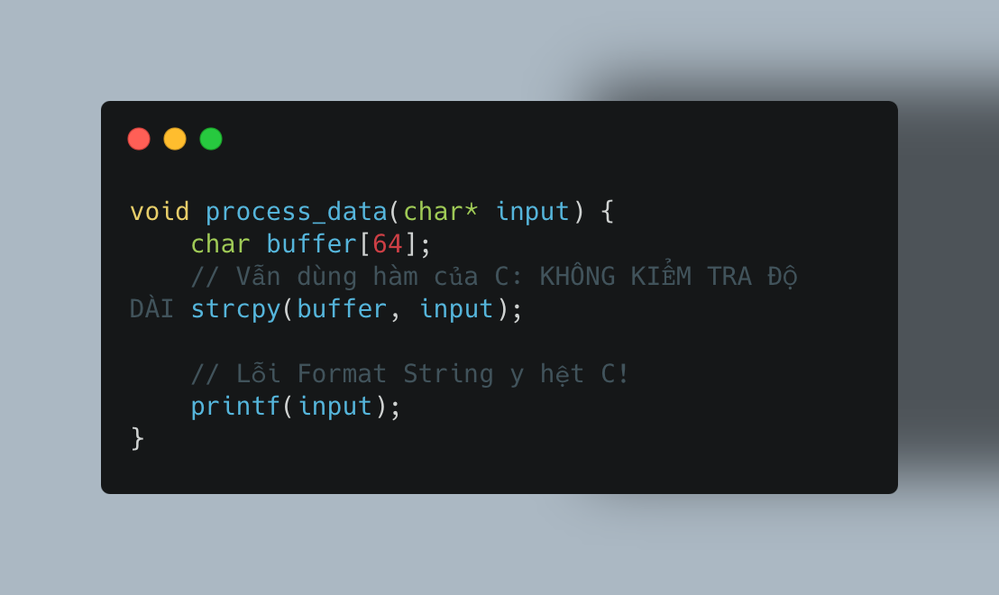
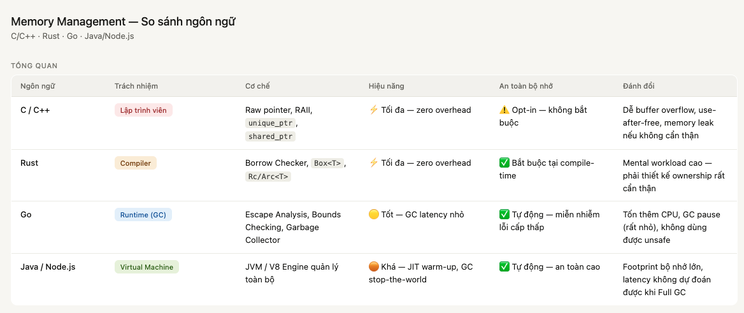
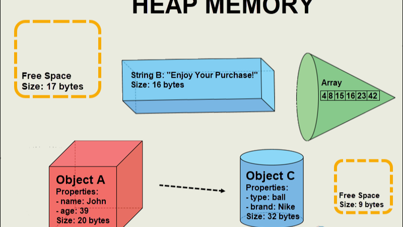
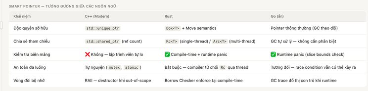
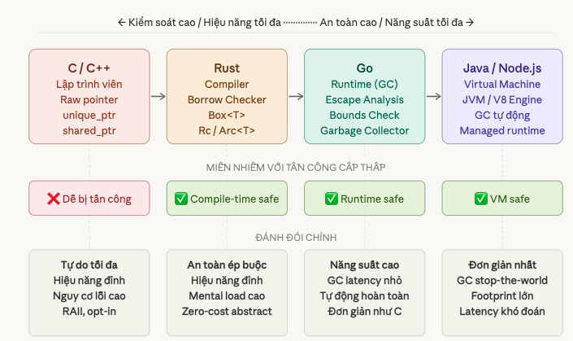

+++
date = '2026-03-16'
draft = false
title = 'Quản lý bộ nhớ qua các thế hệ ngôn ngữ lập trình'
tags = ['memory', 'c++', 'rust', 'golang', 'systems-programming']
+++

Trong suốt nhiều thập kỷ, lịch sử khoa học máy tính đã chứng kiến một sự dịch chuyển mang tính triết lý: chuyển giao trách nhiệm quản lý vùng nhớ từ **Lập trình viên** sang **Trình biên dịch (Compiler)** và **Môi trường thực thi (Runtime)**.

Việc đẩy phần quản lý bộ nhớ cho lập trình viên hay bộ dọn rác (GC) xử lý sẽ tuỳ vào mục đích của người tạo ngôn ngữ lập trình. Với những ngôn ngữ lập trình như C/C++, việc quản lý bộ nhớ cũng cần rất để ý nếu không sẽ dễ gặp các lỗi kinh điển như tràn bộ đệm. Chúng ta xem ví dụ sau:

Trước đây, tại cấp độ vi xử lý, hoàn toàn không có sự khác biệt vật lý nào giữa data và code. Quyền quyết định phụ thuộc hoàn toàn vào con trỏ đang truy xuất nó. Vì vậy các nhà phát triển trình biên dịch và kernel đã áp dụng nhiều các biện pháp bảo vệ như chặn thực thi trong stack, hay bật chế độ ALSR (Address Space Layout Randomization) trên Linux. Mặc dù vậy hacker vẫn có cơ hội thể bypass.

Khi OS đưa ra DEP/NX (chặn thực thi trên stack) và ASLR (xáo trộn địa chỉ), hacker đã tìm ra kỹ thuật **ROP (Return-Oriented Programming)** để bypass. Thay vì bơm mã độc mới vào stack, chúng tận dụng chính những đoạn code hợp lệ đã có sẵn trong bộ nhớ (như thư viện libc) rồi ghép nối chúng lại để làm điều chúng muốn.

Nếu C/C++ giao quyền cho Lập trình viên, Rust giao quyền cho Trình biên dịch, và Go giao quyền cho Runtime, thì Java và Node.js giao toàn bộ sinh mạng cho một cỗ máy ảo (Virtual Machine / Engine).

Các ngôn ngữ như Golang (nếu không dùng package `unsafe`) thực sự miễn nhiễm với các lỗi cấp thấp: Tràn bộ đệm (Buffer Overflow), Lỗi chuỗi định dạng (Format String), hay các cuộc tấn công ghi đè EIP (Ret-to-libc, ROP). Trình biên dịch và Garbage Collector đã khóa chặt cánh cửa này.

## Heap Memory

## Smart Pointer

Để hạn chế những lỗ hổng bộ nhớ cấp thấp, khái niệm **Con trỏ thông minh (Smart Pointer)** đã ra đời. Về bản chất, Smart Pointer là một cấu trúc dữ liệu bọc (wrap) lấy một con trỏ thô (raw pointer) bên trong, đồng thời mang theo các siêu dữ liệu (metadata) hoặc logic để tự động quản lý vòng đời của vùng nhớ đó. Khi một smart pointer thoát khỏi phạm vi (scope), dữ liệu của nó sẽ tự động được xoá khỏi stack và heap.

### 1. Modern C++ (C++11 trở lên): Người tiên phong mang tính tự nguyện

C++ là ngôn ngữ đặt nền móng cho triết lý **RAII (Resource Acquisition Is Initialization)** – gắn vòng đời của một vùng nhớ Heap vào một đối tượng nằm trên Stack. Khi đối tượng trên Stack bị hủy (hết phạm vi hàm), hàm hủy (Destructor) của nó sẽ tự động dọn dẹp vùng nhớ Heap. C++ cung cấp các Smart Pointers tiêu chuẩn:

- **`std::unique_ptr` (Độc quyền sở hữu):** Đảm bảo chỉ có một con trỏ duy nhất được phép trỏ tới vùng nhớ. Khi nó ra khỏi phạm vi, bộ nhớ tự động được `delete`. Hiệu năng của nó nhanh ngang ngửa con trỏ thô của C (Zero-cost abstraction).
- **`std::shared_ptr` (Đếm tham chiếu - Reference Counting):** Cho phép nhiều con trỏ cùng chia sẻ một vùng nhớ. Nó duy trì một biến đếm ngầm; khi biến đếm lùi về 0 (không còn ai sử dụng), bộ nhớ mới thực sự bị giải phóng.

Sự an toàn trong C++ là **tự nguyện (Opt-in)**. Trình biên dịch C++ vẫn cho phép bạn dùng con trỏ thô (`*`), vẫn cho phép dùng hàm `strcpy()` hay mảng C-style.

### 2. Rust: An toàn ép buộc ở tầng compiler (Mandatory Safety)

Rust giao toàn bộ quyền lực cho Trình biên dịch thông qua **Borrow Checker**, ép buộc mọi Smart Pointer phải tuân thủ luật lệ ngay từ lúc gõ code.

- **`Box<T>`:** Tương tự `unique_ptr`, nhưng trình biên dịch Rust sẽ kiểm tra gắt gao việc "chuyển giao quyền sở hữu" (Move semantics). Bạn không thể vô tình dùng lại một `Box` đã bị chuyển quyền.
- **`Rc<T>` và `Arc<T>`:** Tương tự `shared_ptr`, nhưng Rust phân tách rõ ràng phiên bản dùng cho đơn luồng (`Rc`) và đa luồng (`Arc`). Nếu bạn dùng `Rc` (không an toàn) để truyền dữ liệu giữa các luồng (Thread), trình biên dịch sẽ báo lỗi và từ chối tạo file thực thi.

**Triết lý của Rust:** An toàn tuyệt đối tại thời điểm biên dịch. Khối lượng công việc (mental workload) của lập trình viên là rất lớn vì phải thiết kế kiến trúc bộ nhớ cực kỳ chuẩn xác để làm hài lòng Trình biên dịch. Bù lại, hệ thống chạy với hiệu năng tối đa, không có độ trễ, và miễn nhiễm với các lỗi bộ nhớ vật lý.

### 3. Golang: Đẩy hết trách nhiệm cho GC

Khác với C++ và Rust, bạn sẽ hiếm khi thấy thuật ngữ "Smart Pointer" trong tài liệu của Go. Tại sao vậy? Bởi vì Go muốn mang lại trải nghiệm viết code đơn giản như C, nhưng lại an toàn như Java. Trong Go, mọi con trỏ (`*T`) và cấu trúc dữ liệu mặc định đã là "Smart Pointer" nhờ vào sự hậu thuẫn vô hình của Trình biên dịch và Runtime.

Sự "thông minh" của Go được ẩn giấu qua các cơ chế:

- **Slice - Khắc tinh của Buffer Overflow:** Một Slice trong Go không chỉ là một con trỏ như mảng của C. Nó là một cấu trúc dữ liệu (fat pointer) chứa 3 thành phần: một con trỏ thô, chiều dài (length), và dung lượng (capacity). Bất cứ khi nào bạn truy cập `slice[i]`, Runtime của Go tự động thực hiện Bounds Checking (Kiểm tra biên). Nếu `i` vượt quá giới hạn, Go ném ra lỗi `panic` và ngắt chương trình, triệt tiêu hoàn toàn cơ hội để hacker ghi đè lên EIP.
- **Escape Analysis (Phân tích thoát):** Bạn không cần từ khóa `Box` hay `new` để quản lý Heap. Nếu một biến nội bộ bị trả về dưới dạng con trỏ cho hàm khác sử dụng, trình biên dịch Go tự động "nâng cấp" nó và đẩy lên Heap.
- **Garbage Collector (Bộ thu gom rác):** Thay vì đếm tham chiếu như `shared_ptr` hay `Rc`, GC của Go là một tiến trình chạy ngầm, tự động theo dõi đồ thị con trỏ và quét sạch các vùng nhớ không còn ai tham chiếu tới.

**Triết lý của Go:** Tối ưu hóa năng suất. Bạn cứ việc dùng con trỏ thoải mái. Trách nhiệm dọn dẹp và kiểm tra an toàn đã có Runtime (Bounds Checking và GC) lo liệu. Đánh đổi lại, hệ thống sẽ tiêu tốn thêm một chút CPU và có những khoảng trễ cực nhỏ (latency) khi GC hoạt động.

## Tổng kết

Việc lựa chọn ngôn ngữ lập trình sẽ phụ thuộc vào business, team dev, hoàn cảnh cụ thể mà sẽ đưa ra phương án phù hợp, lựa chọn nào cũng có đánh đổi. Không có ngôn ngữ nào phù hợp cho tất cả.
