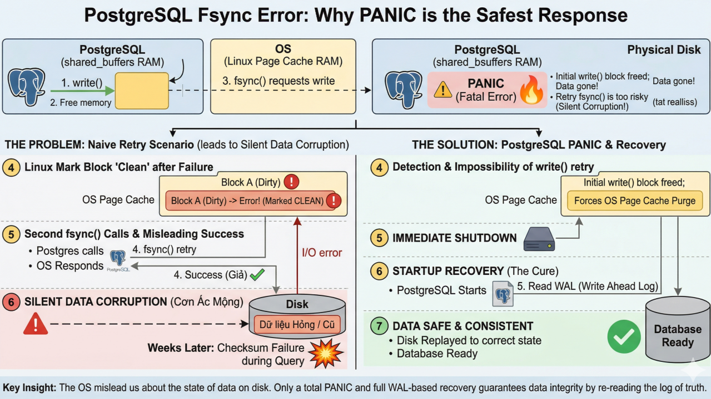
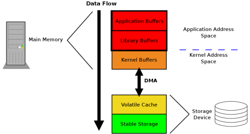
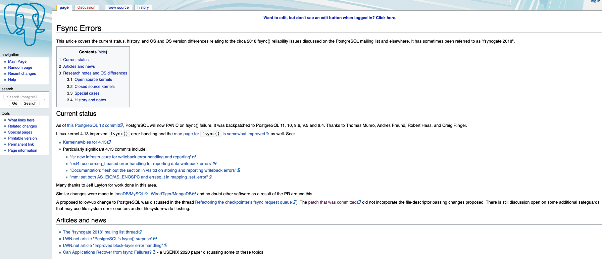
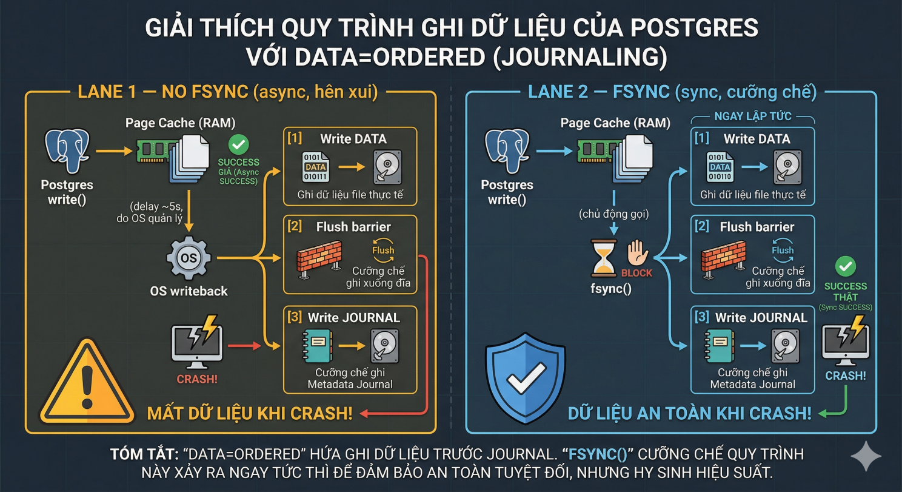
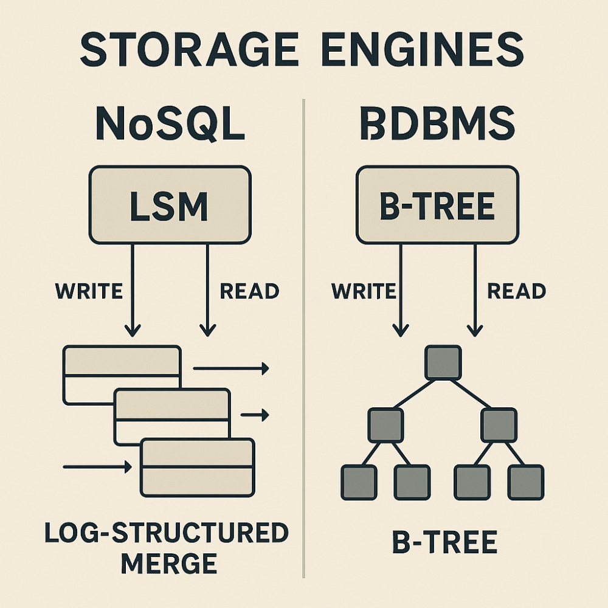

+++
date = '2026-04-04'
draft = false
title = 'Tại sao PostgreSQL chọn PANIC khi fsync thất bại? Tìm hiểu về tính bền vững trong database'
tags = ['postgresql', 'database', 'durability', 'fsync', 'distributed-systems', 'mysql', 'system-design']
+++

*~17 phút đọc*

Vào 1 ngày đóng vai sinh viên hệ "online" của trường Carnegie Mellon University, nghe thầy Andy Pavlo giảng về database, đọc đến đoạn Postgresql sẽ panic khi gọi system call fsync() bị lỗi. Tôi thực sự bất ngờ, lý do đơn giản thôi, một tượng đài database như vậy phải xử lý mượt mà không vết xước chứ nhỉ, vậy tính Durable trong 4 nguyên tắc ACID của hệ quản trị cơ sở dữ liệu như nào? Oke từng đó thắc mắc đủ chúng ta đào bới (deep dive) vụ này rồi.

## Mục lục

- [TLDR](#tldr)
- [Sự kiện tranh cãi "Fsyncgate" 2018](#sự-kiện-tranh-cãi-fsyncgate-2018)
- [Tại sao không gọi lại write() rồi fsync()?](#tại-sao-không-gọi-lại-write-rồi-fsync)
- [Sau vụ Fsyncgate, phía Linux Kernel Dev có hành động gì không?](#sau-vụ-fsyncgate-phía-linux-kernel-dev-có-hành-động-gì-không)
- [Các "ông lớn" khác xử lý thế nào?](#các-ông-lớn-khác-xử-lý-thế-nào)
  - [MongoDB (WiredTiger)](#mongodb-wiredtiger)
  - [SQLite](#sqlite)
  - [MySQL (InnoDB)](#mysql-innodb)
- [Liên hệ trong kiến trúc Hệ thống Phân tán](#liên-hệ-trong-kiến-trúc-hệ-thống-phân-tán---system-architecture)
- [Cuộc chiến kiến trúc: B-Tree vs. LSM-Tree](#cuộc-chiến-kiến-trúc-b-tree-vs-lsm-tree)
- [Bạn có thực sự cần những DB đời mới này không?](#bạn-có-thực-sự-cần-những-db-đời-mới-này-không)
- [Vậy sân chơi của DB đời mới (NewSQL) thực sự dành cho ai?](#vậy-sân-chơi-của-db-đời-mới-newsql-thực-sự-dành-cho-ai)

## TLDR;

- Postgres chọn cách panic khi fsync() lỗi không phải vì kém, mà là để bảo vệ tính Durability của ACID trước sự "lươn lẹo" của OS Page Cache — thà sập máy còn hơn để dữ liệu hỏng ngầm. Sau khi panic, PSQL sẽ khôi phục lại dữ liệu sạch từ WAL.

- MySQL (InnoDB) mặc dù shared buffer pool không sử dụng OS Page Cache mà ghi dữ liệu trực tiếp xuống đĩa bằng cờ O_DIRECT, nhưng vẫn cần fsync cho metadata. Khi fsync lỗi, InnoDB cũng crash và recovery từ checkpoint cuối cùng. Vì WAL thường được ghi bằng cơ chế khác (hoặc được fsync khắt khe hơn), việc quay lại từ WAL đảm bảo tính Durable tốt hơn là cố gắng sửa sai trên các Data Files đang hỏng.

- Postgres tin vào WAL hơn tin vào Data Files. Khi PANIC và khởi động lại, Postgres sẽ thực hiện Redo từ điểm checkpoint cuối cùng. Vì WAL thường được ghi bằng cơ chế khác (hoặc được fsync khắt khe hơn), việc quay lại từ WAL đảm bảo tính Durable tốt hơn là cố gắng sửa sai trên các Data Files đang hỏng.

---

Nghe vô lý vậy? Tại sao một hệ quản trị cơ sở dữ liệu hàng đầu lại chọn cách 'chết đứng' (PANIC) thay vì cố gắng cứu vãn?

## Sự kiện tranh cãi "Fsyncgate" 2018

Sự kiện tranh cãi Fsyncgate vào năm 2018, nơi các kỹ sư giải thích việc PostgreSQL chọn PANIC không phải là một thiếu sót, mà đó chính là cách cực đoan nhất để bảo vệ dữ liệu của người dùng khỏi cơn ác mộng mang tên "Silent Data Corruption" (Hỏng dữ liệu ngầm).

Nếu Postgres không panic, mà ngây thơ gọi lại fsync() lần thứ hai sau khi lần gọi fsync() đầu tiên fail:

- Linux sẽ kiểm tra và thấy: "À, các block này đang được đánh dấu là clean rồi, không cần ghi gì cả" và lập tức trả về Success (Thành công).
- Postgres nhận được chữ "Success", đinh ninh rằng dữ liệu đã an toàn trên đĩa. Nhưng thực tế? Dữ liệu trên đĩa đang bị khuyết thiếu, hỏng file. Lúc này thì không thể cứu được nữa.

Vấn đề ở đây là chúng ta đang nhìn dưới góc nhìn của dev postgresql, chứ chưa nhìn dưới góc nhìn của dev OS Linux Kernel. Dưới góc nhìn của Linux (và một số OS khác lúc bấy giờ), khi fsync thất bại ở một block dữ liệu nào đó, OS có thể tự động đánh dấu block đó là "clean" (đã sạch) hoặc ném nó ra khỏi bộ nhớ đệm, mặc dù dữ liệu chưa hề được ghi xuống ổ cứng!

Cụ thể, Theodore Ts'o đã cho 1 ví dụ hết sức thuyết phục: Ví dụ đang copy dữ liệu từ USB ra Disk, giờ đột ngột rút USB, vậy cái đống data trên RAM gọi fsync bị lỗi, mà không mark clean để remove đi thì hệ thống sẽ rất nhanh chạm ngưỡng hết bộ nhớ memory.

> If the reason why the write failed is because the USB thumb drive was pulled, or the storage array has been set to read-only because of a catastrophic failure, keeping the dirty pages in memory is not useful at all.

Những tình huống tương tự là luôn có mặc dù chỉ với xác suất nhỏ. Và dev thường sẽ không quan tâm đến những trường hợp nhỏ này. Thực tế để dữ liệu có thể ghi từ App Buffers xuống Stable Storage nơi mà thực sự an toàn đi qua nhiều bước hơn bạn nghĩ.

---

## Tại sao không gọi lại write() rồi fsync()?

Oke quay lại vấn đề ban đầu, câu hỏi là nếu khi fsync bị lỗi, mình cho psql gọi lại write() rồi fsync() lại được không? Câu trả lời là không, vì data gọi lại ở lần 2 data trên shared buffer pool chưa chắc còn tồn tại. Thông thường trước khi gọi fsync() chúng ta sẽ gọi lệnh write() đúng không. Postgresql cũng vậy, nó sẽ gọi lệnh write() để đẩy dữ liệu từ shared buffers (nhớ là shared buffers trên RAM nhé) sang OS Page Cache. Một lúc sau psql mới gọi fsync(), sau khi gọi write() psql đã có thể xoá đống data đó trên shared buffer rồi.

Ngoài ra, chi phí để "nhớ mọi thứ" là quá đắt đỏ trong shared buffers. Bạn có thể lập luận: "Vậy tại sao Postgres không giữ khư khư dữ liệu trong Shared Buffers cho đến khi fsync báo Success thì mới xóa?" Câu trả lời là: Hiệu năng (Performance), tôi chỉ nói đến đấy thôi. Nó biết hệ điều hành (Linux) có thể đang "nói dối" về fsync error hoặc đã vứt bỏ dữ liệu lỗi đi rồi. Nên cuối cùng họ vẫn chọn cách panic.

---

## Sau vụ Fsyncgate, phía Linux Kernel Dev có hành động gì không?

Ở bản release 4.13, Linus Torvalds và các cộng sự đã được sửa đổi kiến trúc báo lỗi (cơ chế errseq_t) để không bao giờ "nói dối" hay giấu nhẹm lỗi I/O nữa. Tuy nhiên việc này chỉ là thông báo lỗi chi tiết hơn, còn phần lưu trữ dữ liệu, block mà gọi fsync bị lỗi vẫn được đánh cờ flag là "clean" và ném ra khỏi RAM. Vậy là dữ liệu rác, không toàn vẹn trên ổ đĩa chỉ vẫn còn, mà trên RAM thì mất rồi không fsync được :)) Oke panic thôi.

> **Lưu ý nhỏ:** Từ bản Postgres 11.2, họ có thêm một tham số cấu hình là `data_sync_retry`. Mặc định nó được set là `off` (nghĩa là sẽ PANIC). Bạn có thể ép nó thành `on` để Postgres lờ đi và chạy tiếp, nhưng tài liệu chính thức cảnh báo rằng đây là hành vi "cực kỳ nguy hiểm".

---

## Các "ông lớn" khác xử lý thế nào?

Sự kiện Fsyncgate của Postgres kéo theo một cuộc rà soát toàn diện trên tất cả các Database engine lớn (MySQL, MongoDB/WiredTiger, SQLite...). Và sự thật ngã ngửa là trước đó, hầu hết các DB này đều xử lý sai lỗi fsync.

### MongoDB (WiredTiger)

MongoDB trước Fsyncgate thường bỏ qua lỗi fsync từ write-cache phần cứng, dẫn đến rủi ro mất dữ liệu ngầm. Sau vụ việc, họ cập nhật WiredTiger để phát hiện lỗi fsync (như EIO) và trigger fatal error, buộc server shutdown để admin kiểm tra phần cứng. Điều này tương tự Postgres, nhấn mạnh "thà mất availability còn hơn mất durability".

### SQLite

SQLite trước đây retry fsync thất bại mà không báo lỗi rõ ràng, có thể gây corrupt data trên filesystem lỗi. Các bản cập nhật sau (từ ~3.22+) đã thay đổi: fsync lỗi dẫn đến SQLITE_IOERR_FSYNC và khuyến cáo crash ứng dụng để tránh rủi ro. Nghiên cứu cho thấy fsync failures vẫn gây data loss nếu không xử lý nghiêm ngặt.

### MySQL (InnoDB)

MySQL còn có một chiêu khác nữa, bypass luôn OS Page Cache bằng cách dùng cờ flag O_DIRECT. Vậy câu hỏi đặt ra khi đã dùng O_DIRECT rồi thì chúng ta có cần gọi fsync nữa không? Vì bản chất là flush data từ OS Page cache xuống disk thôi, chúng ta đã bypass rồi thì gọi fsync làm gì nữa? Câu trả lời là vẫn cần.

Thông thường, khi chúng ta muốn ghi dữ liệu xuống files, ngoài việc ghi cục data xuống ổ đĩa, kernel sẽ dùng filesystem (ví dụ ext4), mặc định chế độ journal của filesystem sẽ là ordered, khi đó dù có dùng fsync hay đợi background chạy thì FS cũng sẽ đảm bảo dữ liệu được flush thực sự xuống đĩa trước, rồi mới ghi metadata xuống đĩa, điều này đảm bảo chỉ mục luôn sạch:

InnoDB sử dụng O_DIRECT để bypass page cache, vì vậy metadata sẽ vẫn trong RAM, nên vẫn gọi fsync để đồng bộ metadata của filesystem. Dĩ nhiên khi fsync lỗi thì InnoDB cũng crash giống như Postgres.

Dưới sức ép của cộng đồng sau vụ Fsyncgate, các kỹ sư MySQL đã đệ trình Bug #90296. Từ các phiên bản MySQL 5.7.23 và MySQL 8.0.12 trở đi, hành vi đã được thay đổi hoàn toàn: Nếu fsync() thất bại, InnoDB sẽ coi đó là lỗi FATAL và cố tình làm Crash/Abort toàn bộ server MySQL ngay lập tức.

Tuy nhiên, trên một số hệ điều hành hoặc hệ thống file (như XFS), nếu việc ghi dữ liệu không làm thay đổi kích thước file (ghi đè vào các block đã có sẵn - overwrite), metadata không thay đổi, khi đó chúng ta có thể chỉnh lại InnoDB dùng cờ flag O_DIRECT_NO_FSYNC để bỏ qua fsync.

**Tóm lại:** Trong thế giới Database, khi đối mặt với lỗi I/O ở tầng thấp nhất, nguyên lý chung của tất cả các ông lớn như Postgres, MySQL hay thậm chí MongoDB hiện nay là: "Fail-Stop" — lỗi là Dừng. Crash hệ thống một cách có kiểm soát luôn an toàn hơn hàng vạn lần so với việc dũng cảm chạy tiếp trên một ổ cứng đang hấp hối.

> Nói thêm chút: để data đi xuống được tận cùng của ổ đĩa, các ổ SSD enterprise xịn có thể có đủ thời gian (tích điện trong tụ điện) để flush nốt data từ disk cache vào các ô nhớ khi bị mất điện. Bạn có thể tìm hiểu "Tụ điện PLP trên Enterprise SSD".
>
> Tham khảo: [Ensuring data reaches disk](https://lwn.net/Articles/457667/)

---

## Liên hệ trong kiến trúc Hệ thống Phân tán - System Architecture

Việc Panic khi fsync bị lỗi thực sự rất quan trọng trong kiến trúc cơ bản như master-slave. Định lý "Fail-Fast" trong Hệ thống Phân tán:

Trong thiết kế hệ thống phân tán, có một nguyên tắc vàng: "Một node hoặc là hoạt động đúng 100%, hoặc là phải chết hẳn (Fail-stop). Tuyệt đối không được ngắc ngoải và trả về dữ liệu sai (Byzantine fault)."

Giờ master mà sai thì mấy thằng đệ sai theo hết à, vậy thì còn gì là toàn vẹn dữ liệu nữa. Tốt nhất master panic, mấy thằng còn lại tự bầu chọn Leader mới thông qua giao thức đồng thuận (Raft hoặc Paxos). Kiến trúc của chúng được sinh ra để miễn nhiễm với các lỗi cục bộ kiểu fsync này.

- Quá trình ghi (Write) chỉ được coi là thành công khi đa số (Majority/Quorum) các node đã fsync thành công xuống WAL của chúng.
- Ví dụ cụm có 3 node (A, B, C). Nếu node A bị lỗi fsync và tự PANIC văng ra khỏi mạng, thì dữ liệu vẫn được ghi thành công ở node B và C. Ứng dụng không hề hay biết node A vừa chết. Quá trình xử lý lỗi ở tầng vật lý được che giấu hoàn toàn khỏi end-user.

---

## Cuộc chiến kiến trúc: B-Tree vs. LSM-Tree

Có thể vừa bắt hệ thống durable (fsync) trong hệ thống cluster db, hoặc phân tán (distributed sql), lại vừa ghi nhanh, ít write amplification không? Dĩ nhiên là không, đã làm hệ thống thì luôn luôn có sự đánh đổi trade-off. Các databases đời mới ưu tiên tính sẵn sàng High Availability, lại tối ưu để ghi nhanh (sử dụng kiến trúc LSM Tree), tận dụng WAL - write append only, hạn chế random write như việc dùng cây B-tree - để đánh đổi Network I/O, Read sẽ phức tạp hơn.

Nhìn rộng ra, chúng ta có thể thấy 2 trường phái DBMS:

### Trường phái B-Tree (PostgreSQL, MySQL/InnoDB, Oracle, SQL Server)

- **Triết lý "Update-in-place" (Ghi đè tại chỗ):** Hãy tưởng tượng nó giống như một cuốn danh bạ điện thoại. Khi bạn muốn sửa số điện thoại của ai đó, bạn phải lật đến đúng trang, tẩy số cũ và ghi số mới lên.
- **Điểm mạnh:** Đọc cực nhanh (O(log N)) vì cây B-Tree luôn biết chính xác dữ liệu nằm ở page nào trên đĩa.
- **Điểm yếu:** Tốc độ ghi (Write) chậm khi hệ thống quá tải. Việc tìm đúng vị trí trên đĩa để ghi đè tạo ra Random I/O (I/O ngẫu nhiên) — kẻ thù không đội trời chung của ổ cứng. Hơn nữa, nó sinh ra hiện tượng phân mảnh (fragmentation) và lãng phí không gian (Page Split).

### Trường phái LSM-Tree (TiDB, CockroachDB, Cassandra, RocksDB, LevelDB, ScyllaDB, HBase)

- **Triết lý "Append-only" (Chỉ ghi nối tiếp):** Hãy tưởng tượng nó giống như một cuốn nhật ký. Bạn không bao giờ lật lại trang cũ để tẩy xóa. Có cập nhật hay xóa dữ liệu mới? Cứ viết một dòng mới xuống cuối trang hiện tại. (Xóa thực chất là ghi một dòng mới mang cờ "Tombstone" - Đã chết).
- **Điểm mạnh (Write-Optimized):** Tốc độ ghi cực kỳ khủng khiếp. Bất kể bạn sửa hay xóa, tất cả đều biến thành Sequential I/O (ghi tuần tự) — thứ mà ổ cứng yêu thích nhất.
- **Điểm yếu (Read-Penalty):** Đọc chậm hơn vì dữ liệu của cùng một key có thể nằm rải rác ở nhiều tầng file trên đĩa (SSTables). Đồng thời, hệ thống phải liên tục chạy nền một tiến trình gọi là Compaction (Gom rác) để gộp các file lại và xóa dữ liệu thừa, gây tốn CPU và tạo ra Write Amplification. Mặc dù có thể tối ưu bằng cách mang 5% dữ liệu gần nhất theo thời gian lên RAM, vì thực tế chúng ta chỉ làm việc với những dữ liệu gần đây thôi trong hầu hết các trường hợp.
- **DB phân tán dùng Raft lại "tôn thờ" LSM-Tree** vì để tối ưu tốc độ ghi, đánh đổi lại bù đắp cho độ trễ của network.

---

## Bạn có thực sự cần những DB đời mới này không?

Thực tế chứng minh trong 90% các ứng dụng hiện đại (từ log hệ thống, lịch sử chat, cho đến dữ liệu biến động giá tài chính), lượng truy cập luôn dồn vào 5-10% dữ liệu mới nhất (Hot Data). Dữ liệu càng cũ (Cold Data) thì càng hiếm khi bị sờ tới.

Câu trả lời công bằng nhất là: Chúng sinh ra để giải quyết một nỗi đau có thật, nhưng 99% các công ty không (hoặc chưa) chạm tới ngưỡng đau đó, cụ thể:

- **Nỗi đau của MySQL/Postgres:** Một con MySQL dù xịn đến mấy cũng bị giới hạn bởi phần cứng vật lý của 1 con server. Muốn sharding? Bạn phải tự tay quyết định dữ liệu đọc vào shard nào, tự lo vụ JOIN chéo giữa các máy, và tự khóc khi một máy bị chết.
- **Phép màu của DB đời mới nằm ở chỗ:** Chúng tự động chia nhỏ dữ liệu (Auto-sharding) và rải đều ra hàng chục máy tính. Khi thiếu tải, bạn chỉ việc cắm thêm 1 node mới vào cụm, hệ thống tự động cân bằng lại dữ liệu. Các cloud service provider như AWS, GCP, Azure đều làm việc này hết cho bạn rồi, bạn chỉ việc đóng tiền billing hàng tháng thôi :)). Application của bạn chỉ cần nó đang nói chuyện với 1 con endpoint duy nhất. Dĩ nhiên các database đời mới này, có những con kế thừa rất nhiều core engine của MySQL/Postgres.

### Những Trade-off đẫm máu

**A. Đánh đổi về Hiệu năng Single-Node (Độ trễ - Latency):** Nếu bạn gửi 1 câu query `SELECT * FROM users WHERE id = 1`, Postgres cài trên máy local sẽ xử lý xong trong 0.1ms. Còn CockroachDB/TiDB có thể mất 2ms - 5ms. Tại sao? Vì nó phải gọi RPC (Remote Procedure Call) qua mạng giữa các node, chạy giao thức đồng thuận Raft, rồi mới trả kết quả. Các db này thường sẽ bù lại bằng tốc độ ghi nhanh do dùng append write.

**B. Vận hành phức tạp:** Nó đòi hỏi cấu hình mạng nội bộ cực tốt, đồng bộ thời gian chuẩn xác (như NTP/TrueTime), và khi nó lỗi, việc dò vết (tracing) qua hàng chục node là một cực hình.

**C. Learning Curve (với NoSQL/Serverless):** Nếu bạn dùng NewSQL (TiDB) thì đường cong học tập coi như bằng 0 vì nó giả lập SQL chuẩn. Nhưng nếu bạn bước chân vào thế giới NoSQL phân tán, Serverless, mọi thứ sẽ lật ngược hoàn toàn. Thay vì ném dữ liệu vào bảng rồi thoải mái dùng JOIN, GROUP BY để truy vấn như trong Postgres, bạn phải từ bỏ tư duy chuẩn hóa (Normalization).

---

## Vậy sân chơi của DB đời mới (NewSQL) thực sự dành cho ai?

Cá nhân mình đánh giá MySQL, PostgreSQL vẫn là các tượng đài database, rất nhiều best practice, các kỹ thuật xử lý kinh điển đã được áp dụng. Sân chơi NewSQL chỉ dành cho 1% những gã khổng lồ (Big Tech) mang trong mình 2 "căn bệnh" không thể chữa bằng máy to (Vertical Scaling):

1. **Dữ liệu phình to ở mức Petabyte:** Khi một bảng của bạn có hàng chục tỷ dòng, cái B-Tree Index của MySQL nó to đến mức không nhét vừa RAM của bất kỳ con server nào trên Trái Đất. Lúc đó bạn mới thực sự cần Auto-sharding của NewSQL.
2. **Yêu cầu HA xuyên mặt địa lý (Multi-Region HA):** Uber cần tài xế ở Mỹ kết nối vào server Mỹ, nhưng nếu Data Center ở Mỹ bị cháy, hệ thống phải tự động dồn traffic sang Data Center ở châu Âu mà không làm mất cuốc xe nào. Chỉ có kiến trúc đồng thuận Raft/Paxos phân tán đa khu vực mới làm được điều này.

Với các startup? Hãy cứ ôm chặt lấy Postgres/MySQL. Mua một con server cắm ổ cứng NVMe Enterprise thật to, bạn sẽ có hiệu năng đè bẹp mọi hệ thống phân tán đắt tiền.

Đừng sợ cú PANIC của Postgres. Đó không phải là lỗi, đó là một lời cam kết về sự toàn vẹn dữ liệu.

---

*Ghi chép từ một buổi học của thầy Andy Pavlo – CMU.*

**References:**
- [Ensuring data reaches disk - LWN.net](https://lwn.net/Articles/457667/)
- [PostgreSQL Wiki - Fsync Errors](https://wiki.postgresql.org/wiki/Fsync_Errors)
- [MySQL Bug #90296](https://bugs.mysql.com/bug.php?id=90296)
