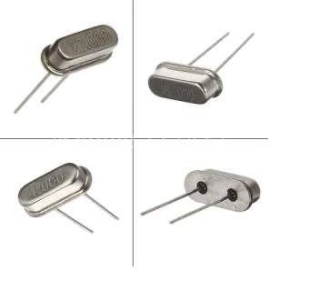
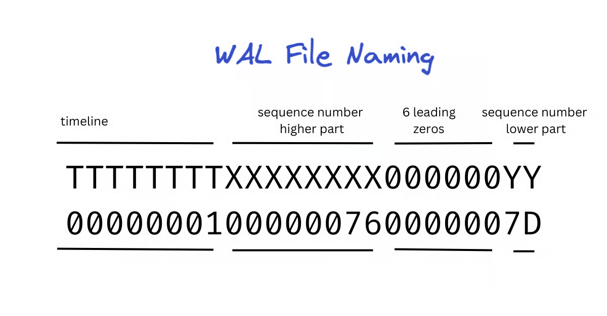
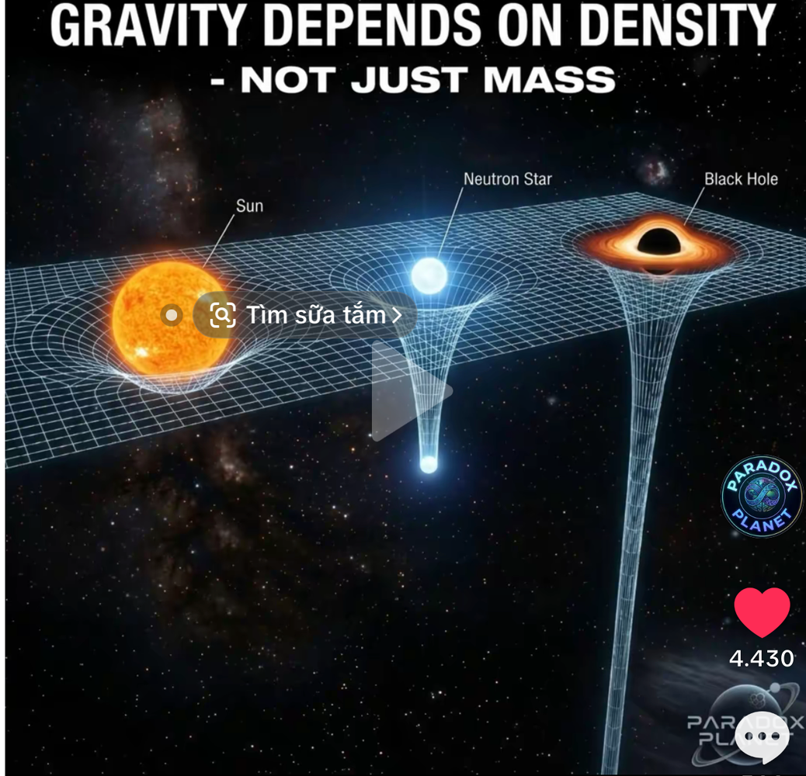

+++
date = '2026-09-29T00:00:00+07:00'
draft = false
title = 'Từ thời gian trong hệ điều hành đến thuyết tương đối của Einstein (Anh-xtanh)'
tags = ['operating-system', 'clock', 'postgresql', 'wal', 'distributed-systems', 'physics']
+++

*~6 phút đọc*

Lấy cảm hứng xuất phát từ những lần tôi lướt Tiktok và xem video của các pháp sư Trung Hoa về chủ đề vũ trụ, không thời gian, thực sự thì họ làm quá hay và hấp dẫn. Đã bao giờ bạn tự hỏi thời gian là gì? Cùng xem định nghĩa 1 giây sau:

## Mục lục

- [Một giây được định nghĩa như thế nào?](#một-giây-được-định-nghĩa-như-thế-nào)
- [Một giây trên máy tính cá nhân](#một-giây-trên-máy-tính-cá-nhân)
- [Hệ điều hành xử lý chênh lệch thời gian (Clock skew) này như thế nào?](#hệ-điều-hành-xử-lý-chênh-lệch-thời-gian-clock-skew-này-như-thế-nào)
- [LSN trong PostgreSQL: đếm byte thay vì đếm giờ](#lsn-trong-postgresql-đếm-byte-thay-vì-đếm-giờ)
- [Lan man về thuyết tương đối](#lan-man-về-thuyết-tương-đối)
- [Kết bài](#kết-bài)

## Một giây được định nghĩa như thế nào?

> Một giây là khoảng thời gian bằng 9.192.631.770 chu kỳ bức xạ điện từ tương ứng với sự chuyển đổi giữa hai mức năng lượng siêu mịn của trạng thái cơ bản của nguyên tử Cesium-133

Hiểu đơn giản là đếm số lần của 1 nguyên tử dao động thôi. Đây cũng chính là cách mà đồng hồ nguyên tử: loại đồng hồ chuẩn xác nhất hiện nay trên thế giới sử dụng. Thay vì dùng dây cót, bánh răng (như đồng hồ cơ), hoặc tinh thể thạch anh thì nó sử dụng tần số dao động của nguyên tử để đo thời gian.

Các kỹ sư dã dùng một máy phát vi sóng để kích thích các nguyên tử Cesium. Khi tần số của máy phát khớp chính xác với tần số của nguyên tử, thiết bị sẽ đếm đủ số lần chu kỳ và phát ra tín hiệu đúng 1 giây. Dự án Google Spanner TrueTime cũng dựa trên nguyên lý này, họ lắp đặt các cụm đồng hồ nguyên tử tại tất cả các trung tâm dữ liệu ở cả địa cầu.

## Một giây trên máy tính cá nhân

*Thạch anh điện tử*

Vậy định nghĩa 1 giây trên máy tính cá nhân thì sao? Trên mainboard (bo mạch chủ) sẽ có một con chip RTC (Real-time clock) sử dụng 1 tinh thể thạch anh, khi có dòng điện chạy qua khiến tinh thể rung 32.768 lần thì coi là 1 giây. Tuy nhiên dần theo thời gian nó sẽ bị lão hoá bởi nhiều yếu tố, vì vậy chúng ta sẽ thấy hiện tại đồng hồ của mình bị sai giờ vài giây mỗi ngày hoặc thậm chí nặng hơn, gây ra hiện tương gọi là Clock Drift.

## Hệ điều hành xử lý chênh lệch thời gian (Clock skew) này như thế nào?

Đầu tiên chúng ta cần biết thông thường Hệ điều hành (OS) có 2 loại đồng hồ là đồng hồ treo tường (Wall Clock) và đồng hồ đơn điệu (Monotonic clock), giờ mà chúng ta nhìn thấy trên máy tính chính là đồng hồ treo tường.

Để chỉnh thời gian bị lệch, OS sẽ thay đổi đột ngột hoặc tăng giảm nhẹ tốc độ của bộ đếm. Việc này hầu như không ảnh hưởng mấy đến hoạt động của hệ thống. Lý do là hầu hết các thao tác liên quan đến hẹn giờ đều dùng đồng hồ đơn điệu, đồng hồ này chỉ tăng dần từ 0 khi khởi động máy lên, không bị ảnh hưởng bởi việc thay đổi trên. Đây cũng là loại đồng hồ được sử dụng bởi các phần mềm ở tầng ứng dụng, tiêu biểu là các database như PostgreSQL.

## LSN trong PostgreSQL: đếm byte thay vì đếm giờ

PostgreSQL thường sẽ có một số đếm gọi là LSN (Log Sequence Number) được tăng mỗi khi có 1 byte thay đổi qua ghi WAL (Write-Ahead Logging). Đây là 1 số 64-bit, việc này để đảm bảo tính toàn vẹn, nhất quán của giao dịch, không bị ảnh hưởng bởi sai lệch thời gian.

*LSN trong tập tin WAL*

Có khi nào số LSN này bị tràn (overflow) không? Câu trả lời là vẫn có, nhưng phải mất xấp xỉ 584 năm nếu chúng ta ghi 1GB/s liên tục 24/7. Khi LSN đầy, PostgreSQL sẽ khóa hệ thống lại ở chế độ Read-Only và phát ra lỗi nghiêm trọng: `ERROR: xlog limit reached`. Đến lúc này thì là công việc của các kỹ sư quản trị cơ sử dữ liệu, dump dữ liệu ra tạo 1 cluster psql mới rồi restore :D Các dòng CSDL phân tán thì phức tạp hơn, chúng ta sẽ không nhắc đến ở đây.

Khi suy nghĩ đến đây, thì chắc hẳn nhiều người đã từng nghĩ hoặc nghe về câu hỏi này rồi. Liệu 1 giây trôi qua của đồng hồ (đồng hồ đeo tay, đồng hồ chạy ở laptop) trên trái đất có khác 1 giây trên sao hoả không?

## Lan man về thuyết tương đối

Trước khi ôn lại thuyết siêu trí tuệ của Anh-xtanh, cùng nhớ lại tiên đề nổi tiếng Ơ-clit (Euclid).

> Tiên đề Ơ-clit (hay tiên đề Euclid) về đường thẳng song song phát biểu rằng: Qua một điểm ở ngoài một đường thẳng, chỉ có một đường thẳng song song với đường thẳng đó.

Cái này thì phổ thông và mọi người đều nắm được, rất trực giác và đúng với lối suy nghĩ của não bộ. Não chúng ta vẫn thường suy nghĩ theo hệ hình học Euclid, nên khi đọc thuyết tương đối sẽ gặp khó khăn đôi chút. Trong không gian ở cấp độ vũ trụ, chúng ta cần tư duy hình học Phi-Euclid, ở đó không gian bị bẻ cong khi có trọng lực mạnh hoặc tốc độ cao, không gian không còn phẳng nữa mà bị uốn cong. Tiêu biểu là hình học Minkowski và hình học Riemann.

Ánh sáng luôn luôn chọn đường thẳng nhất có thể trong môi trường mà nó băng qua (Đường trắc địa - Geodesic), nhưng đường thẳng nhất đó lại chính là cong dưới góc nhìn của 1 người thứ 3 độc lập ở ngoài, và như hình ảnh bạn thấy bên trên đó, khối lượng của hố đen lơn tới mức ánh sáng đi thẳng (theo góc nhìn của nó) nhưng thật ra nó đi tới .. vô hạn và bị hố đen nuốt luôn.

Quay lại vụ đồng hồ lúc đầu, 1 giây trong máy tính laptop cá nhân, tinh thể thạch anh rung 32768 lần, nhưng "quãng đường" nó rung mà nó cho là ngắn nhất trên Sao Hoả, so với quãng đường ngắn nhất nó rung trên trái đất khác nhau, dẫn đến định nghĩa thời gian khác nhau. Vả lại định nghĩa thời gian do con người đặt ra thôi.

## Kết bài

Cùng nhớ lại câu nói nổi tiếng của Einstein trước khi qua đời.

Vài tuần trước khi mất (tháng 3 năm 1955), sau khi người bạn thân thiết của ông là Michele Besso qua đời, Einstein đã viết một lá thư chia buồn gửi tới gia đình Besso với câu nói bất hủ:

> "Bây giờ anh ấy đã rời khỏi thế giới kỳ lạ này trước tôi một chút. Điều đó chẳng có ý nghĩa gì cả. Những người tin vào Vật lý như chúng tôi hiểu rằng: Sự phân chia giữa Quá khứ, Hiện tại và Tương lai chỉ là một ảo giác dai dẳng đến ngơ ngác."

Dưới góc nhìn Thuyết Tương Đối (Khối Vũ trụ 4D), toàn bộ thời gian đã nằm sẵn ở đó. Người bạn Besso của ông không "biến mất", mà chỉ đơn giản là sự tồn tại của người đó nằm ở một tọa độ Không - Thời gian khác trong Vũ trụ.

Toán học lượng tử của toàn bộ Vũ trụ cho thấy Vũ trụ ở trạng thái tĩnh (tĩnh lặng tuyệt đối), không hề có biến Thời gian chạy trong phương trình. Sự "trôi đi" của thời gian chỉ là cách nhận thức nội bộ của các hạt bên trong Vũ trụ khi chúng tương tác và vướng víu lượng tử với nhau.
