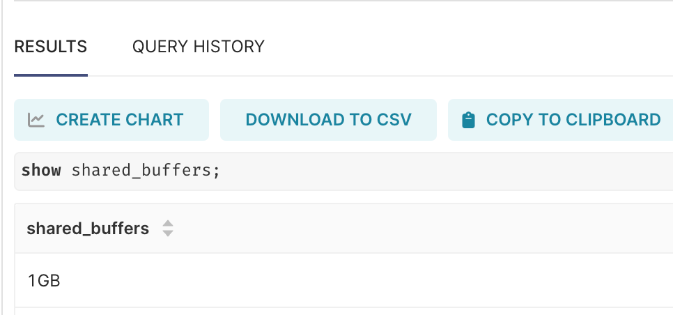
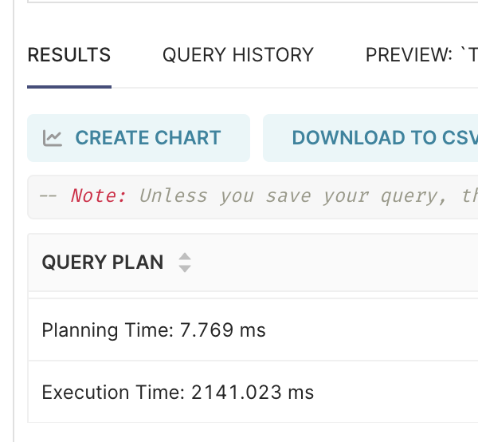

+++
date = '2025-01-11'
draft = false
title = '[Case study] Tôi đã tối ưu 1 query PostgreSQL từ ~60s xuống còn ~2s như thế nào'
tags = ['postgresql', 'database', 'performance', 'sql', 'optimization']
+++


**TLDR;**

* Đánh index với `WHERE` mà `WHERE` chỉ filter được 50% rows thì planner PostgreSQL chọn seq scan (full table scan) vì hiệu quả hơn.
* PostgreSQL để cấu hình mặc định `shared_buffer` 128MB, mà tài nguyên RAM máy chủ đang có nhiều hơn → cần tăng lên để tận dụng hết tài nguyên.
* Dữ liệu query theo nghiệp vụ quá nhiều, từ 500MB đến 1GB cho 1 bảng xong câu lệnh SQL lại `UNION ALL` ghép lại → cần áp dụng một số cơ chế sử dụng bộ nhớ đệm như mview, cache superset hoặc thêm filter timestamp.

---

Tháng 12 vừa rồi em intern data team tôi có viết 1 câu SQL để làm báo cáo cho dashboard, chưa rõ viết kiểu gì sau khi bấm chạy thì sập luôn cả hệ thống dashboard Superset luôn. Tranh thủ cũng có kiến thức về tối ưu cơ sở dữ liệu bèn chạy sang giúp không em ấy không qua thử việc mất :)). Câu lệnh SQL thì khá dài nhưng nhìn chung có dạng như sau:

```sql
WITH all_trades AS (
    SELECT ... FROM logs_exchange_A
        WHERE maker_usd_amount > 0 AND taker_usd_amount > 0
    UNION ALL
    SELECT ... FROM logs_exchange_B
        WHERE maker_usd_amount > 0 AND taker_usd_amount > 0
    UNION ALL
    /* ... similar for other 8 logs tables */
)
SELECT col1, col2, ... col_n
FROM all_trades
WHERE taker_usd_amount < 1000000000
  AND ...
  AND ...
GROUP BY ...
```

Câu lệnh trên sử dụng CTE (Common Table Expression) với từ khóa `WITH`, câu lệnh này sẽ quét từng bảng `logs_exchange_*` sau đó hợp nhất ghép lại thành 1 bảng duy nhất bằng câu lệnh `UNION ALL`, sau đó mới thực hiện truy vấn trên CTE với một số logic select, biến đổi cột và group by.

Câu lệnh này khi chạy mất hơn 60 giây mới xong, thậm chí có lúc còn lâu hơn và bị timeout do cài đặt ở gateway.

## 1/ Kiểm tra mức độ sử dụng tài nguyên máy chủ

Nói gì thì khi bị chậm cứ phải check xem CPU, RAM hay Network có ổn không đã, database bị chậm mà kiểm tra thấy db instance không dùng hết CPU + RAM được cấp phát chứng tỏ là do mình chứ không phải do phần cứng. Và đúng là như thế thật, tôi kiểm tra thì đồ thị usage của CPU với RAM 1 đường thẳng đi ngang, chả có gì thay đổi trước và sau query câu lệnh SQL trên cả.

Khả năng cao là database chưa tận dụng hết tài nguyên máy chủ. Như vậy là cấu hình PostgreSQL có vấn đề, kiểm tra thêm `shared_buffer` xem sao.

### Shared Buffer trong PostgreSQL

**Shared Buffer** trong PostgreSQL là một vùng bộ nhớ được sử dụng để lưu trữ dữ liệu được truy cập từ các bảng và chỉ mục nhằm tăng tốc độ xử lý và giảm số lần truy cập vào đĩa cứng. Đây là một phần quan trọng trong hệ thống bộ nhớ đệm của PostgreSQL.

Hiểu đơn giản `shared_buffer` như vùng bộ nhớ đệm lưu trữ trên RAM, đóng vai trò trung gian cho PostgreSQL đọc/ghi vào trước khi đồng bộ xuống ổ đĩa. Việc đọc hay ghi dữ liệu từ bộ nhớ RAM sẽ nhanh hơn nhiều so với đọc/ghi từ ổ cứng (dĩ nhiên rồi). Nếu anh em chạy phân tích chiến lược thực thi cho một câu lệnh mà thấy phần tỷ lệ `shared_buffer_hit` thấp dưới 95% tức là câu lệnh của anh em chủ yếu đọc ghi từ ổ đĩa.

Theo khuyến cáo, `shared_buffer` chỉ nên chiếm 25% tổng RAM của máy chủ. Mặc định khi cài đặt, PostgreSQL sẽ có cấu hình `shared_buffer` là 128MB, kiểm tra xong thì đúng thế thật, máy chủ của tôi 2GB, tính 25% ra thì chúng ta nên set `shared_buffer` lên 512MB. Oke vậy trước tiên phải tăng `shared_buffer` lên đã, tôi nhờ team SRE tăng RAM lên 4GB và chỉnh `shared_buffer` lên 1GB.



**Query ngay lập tức giảm còn ~15s!**

Vậy là tôi đã khoanh vùng đúng, thử nâng tiếp RAM với `shared_buffer` tiếp lên xem sao, kết quả vẫn thế, vậy là chỗ cấu hình này coi như xong.

## 2/ SQL Explain Analyze

Đi sâu hơn vào phân tích chiến lược thực thi cho câu truy vấn SQL ở trên, chúng ta nhắc lại quan điểm tối ưu DB cái nhỉ — dù làm hươu làm vượn gì thì mục tiêu luôn luôn là số **pages** (hay tên gọi khác là **blocks**) dữ liệu phải quét qua là ít nhất, thường mỗi block có kích cỡ 8KB và chỉ lưu dữ liệu của 1 bảng.

> **Số block dữ liệu quét qua phải là ít nhất**

`EXPLAIN` trong SQL là một lệnh dùng để phân tích và mô tả cách một truy vấn SQL sẽ được thực thi bởi hệ quản trị cơ sở dữ liệu. Nó cung cấp thông tin chi tiết về kế hoạch thực thi truy vấn, giúp người dùng hiểu rõ hơn về cách cơ sở dữ liệu tối ưu hóa truy vấn và các bước cụ thể mà nó thực hiện.

Thường thì tôi sẽ kiểm tra chiến lược thực thi trong PostgreSQL bằng câu lệnh `EXPLAIN ANALYZE SELECT * FROM A`, lúc cần xem chi tiết hơn xem cache hit như nào, có đọc ghi xuống ổ cứng nhiều không thì gõ thêm `EXPLAIN (ANALYZE, BUFFERS)`.

Sau khi lấy chiến lược thực thi, phần chậm nhiều nhất chính là ở đoạn `UNION ALL` nơi mà các bảng đều thực hiện **Full Table Scan (Seq Scan)**. Mà tôi kỳ vọng chỗ này đáng ra planner của PostgreSQL phải dùng **Index Range Scan** hoặc **Bitmap Range Scan**. Tuy nhiên tại sao lại không ăn index mặc dù đã đánh composite cho các cột ở `WHERE` rồi?

### Kiểm tra nguyên nhân tại sao đánh index mà query WHERE không ăn index?

Trong đầu tôi nghĩ đến việc kiểm tra mật độ phân phối của dữ liệu với câu lệnh `WHERE`, cụ thể ở đây sẽ kiểm tra đơn giản như sau:

```sql
SELECT count(*) FROM A WHERE maker_usd_amount > 0 AND taker_usd_amount > 0;
```

Kết quả trả về số count bằng tới **50% tổng số dòng** của bảng. Kiểm tra thêm tài liệu và ChatGPT, Claude thì PostgreSQL sẽ chọn chiến lược quét bảng tuỳ thuộc vào số lượng rows như sau:

* Khi số rows lọc được **nhỏ hơn 5–10%** tổng số lượng trong bảng: **Index Scan** sẽ được dùng
* Trong khoảng **5–25%**: PostgreSQL Planner sẽ chọn **Bitmap Scan**
* Từ **25–30% trở đi**: Planner sẽ dùng **Sequential Scan**

Kết quả đã rõ — nguyên nhân do dữ liệu phân phối lệch, câu lệnh `WHERE` của tôi chỉ lọc được khoảng 50% tổng số lượng bản ghi, con số quá nhiều và không phù hợp cho PostgreSQL Planner chọn Index Scan hoặc Bitmap Scan để quét dữ liệu trong bảng, nó tính dùng Sequential Scan khi quét sẽ cho chi phí (costs) rẻ hơn.

Vậy cứ không phải cứ dùng index là nhanh, cứ đánh index là query bắt buộc phải ăn. Planner sẽ luôn chọn đường đi nào có chi phí nhỏ nhất để thực hiện. Khi dữ liệu cần lọc ở điều kiện `WHERE` quá bán thì việc quét tuần tự lại là phương án hiệu quả nhất.

Ngoài ra khi quét tuần tự thì database sẽ không phải dùng random I/O access xuống ổ đĩa khi gặp cache miss ở `shared_buffer`. Việc đọc tuần tự I/O access theo từng blocks ở ổ đĩa có thể tận dụng thêm cơ chế cache của OS (OS có thể prefetch trước các blocks).

## 3/ Kiểm tra nghiệp vụ truy vấn

Sau khi đã kiểm tra vấn đề ăn index, tốc độ bây giờ đã cải thiện tuy nhiên vẫn chậm quanh đâu đó 15s do dữ liệu phải truy vấn nhiều theo yêu cầu từ business. Tôi có trao đổi lại bạn Data Analysis thì có một số giải pháp cho vấn đề này:

* **Thêm filter timestamp**: Thực tế trước mắt chỉ cần dữ liệu cho 1 tháng gần nhất, như vậy có thể thêm trường timestamp vào câu lệnh điều kiện `WHERE` và đánh composite BTree theo thứ tự `(timestamp, maker_usd_amount, taker_usd_amount)`. Khi đưa lên dashboard Superset, dashboard sẽ dựa trên trường timestamp để người dùng có thể tuỳ chỉnh đồ thị theo ý mình.
* **Dùng Materialized View**: Nếu vẫn muốn tổng hợp data trong 1 năm thì sao? Dữ liệu ở khung thời gian lớn thường ít thay đổi, có thể tận dụng `MATERIALIZED VIEW` (mview) để cache lại tất cả các bảng sau khi đã `UNION ALL`, sau đó chúng ta không phải `UNION` mỗi lần chạy câu truy vấn nữa. Hoặc anh em nào dùng Superset có thể vào cấu hình chỉnh lại cache dữ liệu theo ngày, mỗi ngày người vào dashboard đầu tiên sẽ phải refresh lại toàn bộ dữ liệu, những lần vào tiếp theo sẽ lấy dữ liệu từ bộ nhớ đệm của Superset.

Ngoài ra chúng ta có thể đề xuất một số phương án bổ sung thêm:

* Quy hoạch lại cơ sở dữ liệu, sử dụng ổ cứng SSD xử lý nhanh cho tablespace quan trọng, ưu tiên về tốc độ đọc/ghi.
* Dự đoán tốc độ tăng trưởng của bảng và đánh **partition** cho bảng vì nghiệp vụ phân tích yêu cầu tổng hợp kết quả theo tháng. Thông thường nên bắt đầu nghĩ tới việc đánh partition khi kích thước bảng lớn hơn 2GB.

## Thành quả sau khi tối ưu



---

Như vậy, tôi đã điểm qua một số kỹ thuật mà tôi thường dùng khi tối ưu. Câu truy vấn khi phân tích dữ liệu còn loanh quanh 1–2s thay vì ~60s như lúc ban đầu. Hi vọng bài viết này sẽ giúp ích cho bài toán của bạn.

Cảm ơn các bạn vì đã đọc.
